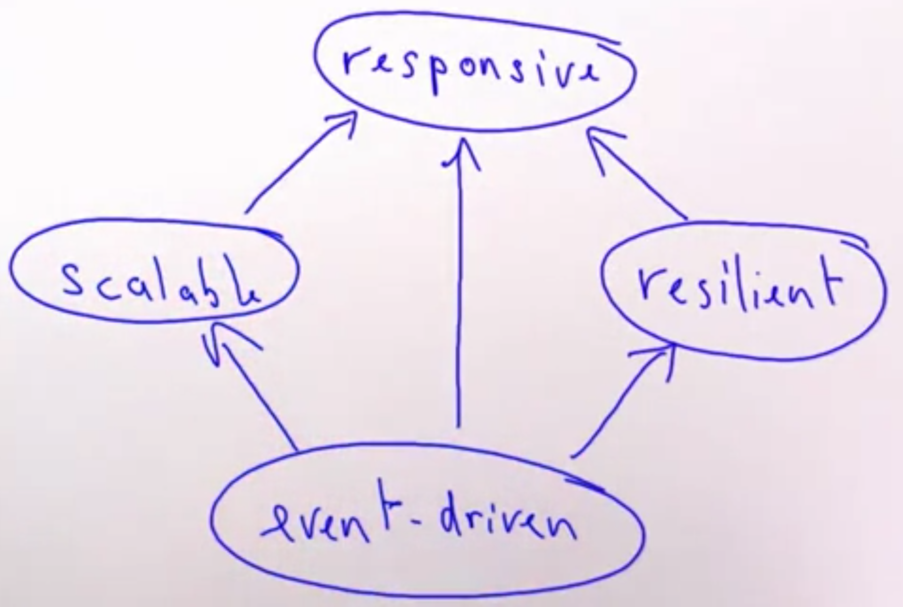

# What is Reactive Programming?

**Previously**: Managed servers and containers.

**Now**: Reactive Applications:

- Event-driven.
- Scalable.
- Resilient.
- Responsive.

[Merriam Webster] reactive: "readily responsive to a stimulus".

- React to events (event-driven).
- React to load (scalable).
- React to failures (resilient).
- React to users (responsive).

## Event-Driven

**Traditionally**: Systems are composed of multiple threads, which communicate with shared, synchronized state => Strong coupling, hard to compose.

**Now**: Systems are composed from loosely coupled event handlers  => 	Events can be handled asynchronously, without blocking.

## Scalable

An application is scalable if it is able to be expanded according to its usage:

- scale up: make use of parallelism in multi-core systems.
- scale out: make use of multiple server nodes.

Important for scalability: Minimize shared mutable state.

Important for scale out: Location transparency (It should not matter where the computation is located, could be on the same computer of the client or some other servers, functionality should remain the same), resilience (cope with failures).

## Resilient

An application is resilient if it can recover quickly from failures.

Failures can be:

- Software failures.
- Hardware failures.
- Connection failures.

Typically, resilience cannot be added as an afterthought; it needs to be part of the design from the beginning.

Needed:

- loose coupling.
- strong encapsulation of state.
- pervasive supervisor hierarchies.

## Responsive

An application is responsive if it provides rich, real-time interaction with its users even under load in the presence of failures. Responsive applications can be built on an event-driven, scalable and resilient architecture. Still need careful attention to algorithms, system design, back-pressure, and many other details.
