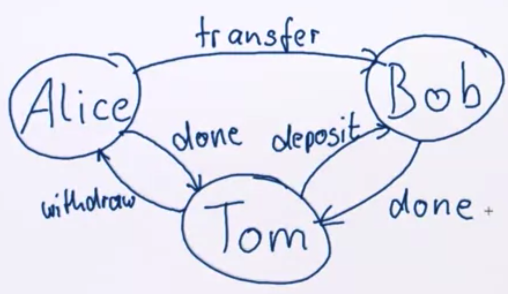
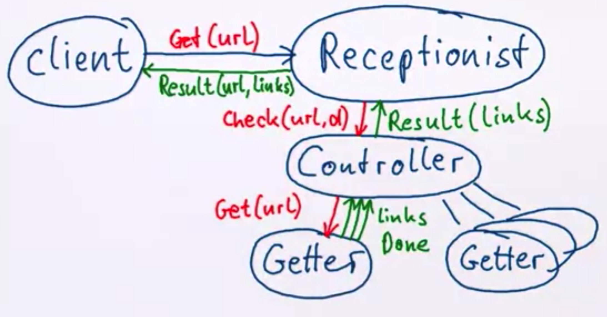

# The actor model

The actor model represents objects and their interactions, resembling human organizations and built upon the laws of physics.

An Actor:

- Is an object with identity.
- Has a behavior.
- Only interacts using asynchronous message passing.

The actor trait describes the behavior of an Actor, its response to messages.

```scala
type Receive = PartialFunction[Any, Unit]

trait Actor {
  def receive: Receive
  ...
}

class Counter extends Actor {
  var count = 0
  // this is the partial function returned when the message is received.
  def receive = {
    case "incr" => count += 1
  }
}
```

**Actors can send messages to addresses (ActorRef) they know:**

```scala
class Counter extends Actor {
  var count = 0
  // In this case if we get a tuple with a string "get" and something of type ActorRef, we can send to the customer the count as message (customer ! count).
  def receive = {
    case "incr" => count += 1
    case ("get", customer: ActorRef) => customer ! count
  }
}
```

**Behind the scenes each actor knows his address, and is implicitly available. Sending a message from one actor to the other picks up the sender's address implicitly.****

```scala
trait Actor {
  implicit val self: ActorRef
  // the actor sending the message.
  def sender: ActorRef
  ...
}

abstract class ActorRef {
  // if we use the ! as previously takes implicit argument picking up the self reference.
  def !(msg: Any)(implicit sender: ActorRef = Actor.noSender): Unit
  // if we wanna pass esplicitly the reference, we use the below function.
  def tell(msg: Any, sender: ActorRef) = this.!(msg)(sender)
  ...
}

// So knowing that, we can make the Counter class nicer.
class Counter extends Actor {
  var count = 0
  // In this case if we get a tuple with a string "get" and something of type ActorRef, we can send to the customer the count as message (customer ! count).
  def receive = {
    case "incr" => count += 1
    case "get" => sender ! count
  }
}
```

**An actor can do more things then just send messages, it can create other actors, can change is behaviour, to access those functions we need to know about the actor's context.**

```scala
trait ActorContext {
  /* Each actor has a stack of behaviour and the top-most one is always the active one. Become replaces the top of the stack with new behaviour, instead, unbecome is used to pop the top behaviour. */
  def become(behavior: Receive, discardOld:Boolean = true):Unit
  def unbecome(): Unit
  ...
}

trait Actor {
  // Access to the context within the actor just using 'context'.
  implicit val context: ActorContext
  ...
}

// We can reformulate so the Counter actor to not use var.
class Counter extends Actor {
  // In this case if we get a tuple with a string "get" and something of type ActorRef, we can send to the customer the count as message (customer ! count).
  def counter(n: Int): Receive = {
    /* if we get incr message, we change our behaviour to getting a counter of (n + 1), for example before was 0 and the first message will be counter(0+1).
    Note: context.become evaluates counter(n+1) only when the next message is processed ( DESIGNATE THE BEHAVIOR FOR THE NEXT MESSAGE).*/
    case "incr" => context.become(counter(n + 1))
    // We can just reply to get request with current counter value n.
    case "get" => sender ! n
  }
  
  // we start the behaviour of 0
  def receive = counter(0)
}
```

**Actor can be created or stopped. Actors are created by actors => they naturally create hierarchies. "Stop" is often applied to "self" => actor itself decide to terminate.**

```scala
trait ActorContext {
  def actorOf(p: Props, name: String): ActorRef
  def stop(a: ActorRef): Unit
  ...
}
```

An actor application:

```scala
// the main is an Actor itself.
class Main extends Actor {
  
  	// creates an Actor from the class Counter called counter.
    val counter = context.actorOf(Props[Counter], "counter")

  	// we send messages to this counter.
    counter ! "incr"
    counter ! "incr"
    counter ! "incr"
    counter ! "get"

  // Since the counter will reply we will receive the count of type Int, that it prints and after stop itself.
    def receive = {
      case count: Int =>
      		// the result is 3
          println(s"count was $count")
          context.stop(self)
 		}
  }
```

**Summary of the Actor Model of Computation:**

**Upon recepetion of message the actor can do any combination of the following:**

- **Send messages.**
- **Create actors.**
- **Designate the behavior for the next message.**

## Message processing semantics

### Actor Encapsulation

Access to the state is possible only accessing messages. Only messages can be sent to known addresses (ActorRef):

- Every actor knows its own address (self).
- Creating an actor returns its address.
- Addresses can be sent within messages (e.g. sender).

Actors are completely independent agents of computation:

- Local execution, no notion of global synchronization.
- All actors run fully concurrently.
- Message-passing primitive is one-way communication.

### Actor Inside

**An actor is effectively single-threaded:**

- Messages are received sequentially.
- Behavior change is effective before processing the next message.
- Processing one message is the atomic unit of execution.

**This has the benefits of synchronized methods, but blocking is replaced by enqueueing a message.**

### Bank Account Example

It is good practice to define an Actor's messages in its companion object.

```scala
class BankAccount extends Actor {
	import BankAccount._
  
  var balance = BigInt(0)
  
  def receive = {
    	case Desposit(amount) 										 =>  balance += amount
    													 											 sender ! Done
    
    	case Withdraw(amount) if amount <= balance => balance -= amount
    																								sender ! Done
    
    	case _                                     =>  sender ! Failed
    
    
  }
}

object BankAccount {
  case class Deposit(amount: BigInt){
    	require(amount > 0)
  }
  case class Withdraw(amount: BigInt){
    require(amount > 0)
  }
  case object Done
  case object Failed
}
```

### Actor Collaboration

- Picture actors as persons.
- Model activities as actors.



**Translated in code**: 

```scala
class WireTransfer extends Actor {
  import WireTransfer._
  
  def receive = {
    	case Transfer(from, to, amount) => 
    			// The from actor receives a message to withdraw the amount.
    			from ! BankAccount.Withdraw(amount)
    			/* This actor changes the behaviour waiting the withdraw activity.
    				 Wil not run any other activity, except a new message is sent to it.
    	     */
    			context.become(awaitWithdraw(to, amount, sender))
  }
  
  def awaitWithdraw(to: ActorRef, amount: BigInt, client: ActorRef): Receive = {
    	case BankAccount.Done => 
    	// If the bank account replies with done, we proceed, and send the deposit to the recipient account and we wait the result of that deposit.
    		to ! BankAccount.Deposit(amount)
    		context.become(awaitDeposit(client))
    // If it fails probably there were not sufficient funds, than we need to tell the client and stop the transaction.
   		case BankAccount.Failed => 
    		client ! Failed
    		context.stop(self)
  }
  
  def awaitDeposit(client: ActorRef): Receive = {
    // We wait the done message from the account that was suppose to receive the deposit. Once we get it, we confirm that transaction has been successful and stop the transaction.
    case BankAccount.Done => 
    		client ! Done
    		context.stop(self)
  }
}

object WireTransfer {
  // Transfer from his bank account to another bank account.
  case class Transfer(from: ActorRef, to: ActorRef, amount: BigInt)
  case object Done
  case object Failed
}
```

### Message Delivery Guarantees

- **All communication is inherently unreliable.**
- **Delivery of a message requires eventual availability of channel & recipient.**

**Types:**

- **At-most-once: sending once delivers [0, 1] times (the less costly, can be done without keeping any state).**
- **At-least-once: resending until acknowledged delivers [1, infinity) times (medium cost, the sender buffers the messages sent).**
- **Exactly-once: processing only first reception delivers 1 time (the most costly of the 3 options, additionally to the buffer on the sender, the receiver has to keep track of which message has already been processed).**

**Messages support reliability:**

- **All messages can be persisted.**
- **Can include unique correlation IDs. (enable exactly once semantic, because the receiver can see if has already received this message)**
- **Delivery can be retries until successful.**

**Reliability can only be ensured by business-level acknowledgement**.

### Making the Transfer (previous example) reliable

- Log activities of WireTransfer to persistent storage.
- Each transfer has a unique ID (by which can be identified in withdraw and deposit message, in this way doesn't perform those two operations more than once).
- Add ID to Withdraw and Deposit.
- Store IDs of completed actions within BankAccount.

### Message Ordering

**If an actor sends multiple messages to the same destination, they will not arrive out of order (this is AKKA-specific, because actor are single thread, executing sequentially operations). Either of this messages can be lost, of course, but will not be develipered out of order. There is not a full casualty if more actors are involved, just the order of messages by a single actor to another one (pair) is guaranteed.**

### Summary

- **Actors are fully encapsulated, independent agents of computation.**
- **Messages are the only way to interact with actors.**
- **Explicit messaging allows explicit treatment of reliability.**
- **The order in which messages are processed is mostly undefined.**

## Designing Actor Systems

Imagine giving the task to a group of people, diving it up.

Consider the group to be of very large size.

Start with how people with different tasks will talk with each other.

Consider these "people" to be easily replaceable.

Draw a diagram with how the task will be split up, including communication lines.

**Example**: The Link Checker

Write an actor system which given a URL will recursively download the content, extract links and follow them, bounded by a maximum depth; all links encountered shall be returned.



### Plan of Action

1. Write web client which turns a URL into a HTTP body asynchronously. We will be using "com.ning" % "async-http-client" % "1.7.19".
2. Write a Getter actor for processing the body.
3. Write a Controller which spawns Getters for all links encountered.
4. Write a Receptionist managing one Controller per request.

### Web Client

```scala
private val client = new AsyncHttpClient

// FOR REACTIVE APPLICATION BE ASYNCHRONOUS BY DEFAULT IS A MUST, WE DO NOT WANNA BLOCK SOME ACTOR AND CAUSING A BOTTLENECK.
def get(url: String)(implicit exec: Executor): Future[String] = {
  	val f = client.prepareGet(url).execute();
    // We construct a promise to adapt f to a Scala Future.
  	val p = Promise[String]()
  
  	// When the future is completed the listener will run and gets executed
  	f.addListener(new Runnable {
      def run = {
        // f.get doesn't block here, because we know that get request has been completed. (It is bad practice to block the single thread in an actor).
        val response = f.get
        if(response.getStatusCode < 400)
        // gets the first 131072 bytes from the response
        	p.success(response.getResponseBodyExerpt(131072))
        else p.failure(BadStatus(response.getStatusCode))
      }
      
      // we need a Thread pool exec to run this task
    }, exec)
  
  // we return a future
  p.future
}
```

**A reactive application is non-blocking & event-driven from top to bottom. If there is any blocking piece in it, it will infect all other codes and actors.**

### Finding Links

```scala
import org.jsoup.Jsoup
import import scala.collection.JavaConverters._

def findLinks(body: String): Iterator[String] = {
  val document = Jsoup.parse(body, url)
  val links = document.select("a[href]")
  
  for {
    link <- links.iterator().asScala
  } yield link.absUrl("href")
}
```

### The Getter Actor

```scala
class Getter(url: String, depth: Int) extends Actor {
  implicit val exec = context.dispatcher
  
  // get and pipeTo need an exectuor for the context where they need to run, because are asynchronous operations and is picked up by implicit val exec.
  WebClient get url pipeTo self
 		 // that is equivalent to :
  	/* val future = WebClient.get(url)
  		 future.pipeTo(self)
  	*/
 		// pipeTo is equivalent to:
    /* future onComplete {
        case Success(body) => self ! body
        case Failure 			 => self ! Status.Failure(err)
    } */
  
  // with the previous line we managed to let arrive at the actor the url, so in this case what happens is:
  def receive = {
    case body: String => 
    // if we get a string that is the body we look for links inside
    		for (link <- findLinks(body))
    				// for each of those links we send it to the parent (the actor that created the current one), what we send is a message to check the link we found and the depth.
    				context.parent ! Controller.Check(link, depth)
    // Once we communicated all the links we stop, which means sending a Done message.
    		stop()
    case _: Status.Failure => stop()
  }
  def stop(): Unit = {
    context.parent ! Done
    context.stop(self)
  }
}
```

**Actors are run by a dispatcher - potentially shared between multiple actors - which can also run Futures.**

### Actor-Based Logging

- Logging includes IO which can block indefinitely => bad for reactive programming.
- Akka's logging passes that task to dedicated actors (because sending to actor is a non-blocking operation).
- Supports ActorSystem, wide levels of debug, info, warning, errors.
- Set level using setting akka.loglevel=DEBUG (for instance).

```scala
class A extends Actor with ActorLogging {
  def receive = {
    case msg => log.debug("receive message: {}", msg)
  }
}
```

### The Controller Actor

```scala
class Controller extends Actor with ActorLogging {
  // cache is shared, but points to immutable data structure, because in this way, due the fact that immutable data structure when adding a new element are re-created, the actors are always pointing to the same immutable data structure that with time changes the memory position.
  var cache = Set.empty[String]
  var children = Set.empty[ActorRef]
  
  def receive = {
    	case Check(url, depth) => 
    		log.debug("{} checking {}", depth, url)
    		if(!cache(url) && depth > 0)
    			children += context.actorOf(Props(new Getter(url, depth -1)))
    		cache +=url
    	
    	case Getter.Done => 
    		children -= sender
    		if (childre.isEmpty) context.parent ! Result(cache)
  }
}
```

**Prefer immutable data structures, since they can be shared.**

### Handling Timeouts

```scala
import scala.concurrent.duration._

class Controller extends Actor with ActorLogging {
  	// Sends a ReceiveTimeout every 10 seconds, is reset after each message received.
  	context.setReceiveTimeout(10.seconds)
  	...
  	def receive = {
      	case Check(...) => ...
      	case Getter.Done => ...
      // if we receive a timeout after 10 seconds, we tell all our children to abort. Of course we have to code this functionality in the getter ... case Abort => stop()
      	case ReceiveTimeout => children foreach (_ ! Getter.Abort)
    }
}
```

**Note: Akka Includes a timer service optimized for high volume, short durations and frequent cancellation. With this trait is possible to send at certain point in time to an actor a message (but you can have race condition).**

**NOTE: Do not refer to actor state from code running asynchronously. For example using futures or the scheduler. At the time it is referenced the actor can be referencing a different actor state.**

### The Receptionist

```scala
class Receptionist extends Actor {
  def receive = waiting
  
  val waiting: Receive = {
    // upon Get(url) start a traversal and become running
    // eventually the component that is spawned in runNext  will return a Result (goes to running state)
    case Get(url) => context.become(runNext(Vector(Job(sender,url))))
  }
  
  def running(queue: Vector[Job]): Receive = {
    // upon 	Get(url) append that to queue and keep running (not execute immediately)
    // if we are in the running state and a get request is received, we simply enqueue it.
    case Get(url) => context.become(enqueueJob(queue, Job(sender, url)))
    // upon Controller.Result(links) ship that to the client and run next job from the queue (if any)
    // when the controller return a result, we extract from the queue the job and we send to the client the result, than we stop the controller and process the next request from the tail of the queue, if it is empty, goes to the waiting state.
    case Controller.Result(links) => 
    		val job = queue.head
    		job.client ! Result(job.url, links)
    		context.stop(sender)
    		context.become(runNext(queue.tail))
  }
}

case class Job(client: ActorRef, url String)
	var reqNo = 0
	def runNext(queue: Vector[Job]): Receive = {
    reqNo += 1
    if (queue.isEmpty) waiting
    else {
      //reqNo because actor's name has to be unique
      val controller = context.actorOf(Props[Controller], s"c$reqNo")
      controller ! Controller.Check(queue.head.url, 2)
      running(queue)
    }
    
    // it is uses to enqueue a job
    def enqueueJob(queue: Vector[Job], job: Job): Receive = {
      // if the queue is bigger than 3 we reply with failure and stay with the current state
      if (queue.size > 3)
      	sender ! Failed(job.url)
      	running(queue)
      // otherwise we append the request
      else running (queue :+ job)
    }
  }
```

**Prefer context.become for different states (to switch between different Akka Actor states), with data local to the behavior. More info on context.become: [alvin-alexander-blog](https://alvinalexander.com/scala/akka-actors-switch-between-states-with-become/)**.

## Testing Actor Systems

**Tests can only verify externally observable effects, because the tests can be performed only sending messages (black-box testing).**

To send messages we can use Akka's TestKit.

```scala
implicit val system = ActorSystem("TestSys")
val toggle = system.actorOf(Props[Toggle])
val p = TestProbe()
p.send(toggle, "How are you")
p.expectMsg("happy")
p.send(toggle, "unknown")
p.expectNoMsg(1.second)
system.shutdown()
```

Accessing the real DB or production web services is not desirable, we can use dependency injections in actors as well. We can use for example akka with spring.
