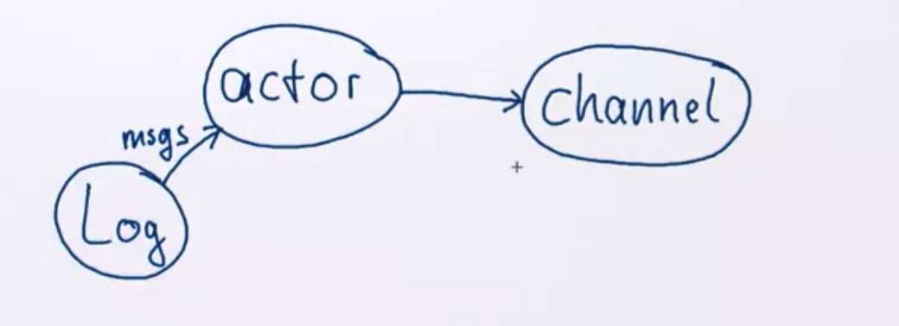

# Handling Failure and State

## Failure Handling With Actors

Resilience demands containment and delegation of failure.

- In order to achieve this, we need containment, it means that the failure is isolated and so can't spread to other components, the actor model, takes care of this, because actors are fully encapsulated objects.

- The second is that failure can not be handled by the failed component, because it is compromised, so must be delegated to others. So another actor has to decide what to do with a failed actor (terminated or restarted). One to delegate the role of supervisor, having more than one requires to collaborate with different actors, is more difficult to achieve, so in practice we have just one supervisor.

In Akka the parent declares how its child Actors are supervised:

```scala
class Manager extends Actor {
  // this override the default strategy of the supervisor, for default it restarts the children when they fail, but we wanna have a personalized behaviour.
  override val supervisorStrategy = OneForOneStrategy() {
    case _: DBException => Restart // reconnect to DB
    case _: ActorKilledException => Stop
    case _: ServiceDownException => Escalate
  }
  ...
  // this actor supervise two children, a db actor and a service one.
  context.actorOf(Props[DBActor], "db")
  context.actorOf(Props[ImportantServiceActor], "service")
  ...
}
```

Note: In the Actor at the moment of the restart, the message causing the failure, will not be processed.  The Actor Lifecycle, is split in 3 states, start, (restart)*, stop.


We see from the diagram that there are hooks that can be customized (like PreRestart), E.G.:

```scala
trait Actor {
  def preStart(): Unit = {}
  def preRestart(reason: Throwable, message: Option[Any]): Unit = {
    context.children foreach (context.stop(_))
    postStop()
  }
  def postRestart(reason: Throwable): Unit = {
    preStart()
  }
  def postStop(): Unit = {}
  ...
}
```

## Lifecycle Monitoring and The Error Kernel

The only observable transition occurs when stopping an actor:

- Having an ActorRef implies liveness (at some earlier point).
- Restarts are not externally visible (an external observer can't really tell if an actor was restarted).
- After stop there will be no more responses (but we don't know the cause).

No replies could also be due to communication failure, therefore Akka supports Lifecycle Monitoring a.k.a **DeathWatch**:

- An actor registers its interest using context.watch(target).

- It will receive a Terminated(target) message when target stops.

- It will not receive any direct messages from target thereafter (the messages obviously are received before the terminated message).

  DeathWatch Api:

  ```scala
  trait ActorContext {
    def watch(target: ActorRef): ActorRef
    def unwatch(target: ActorRef): ActorRef
    ...
  }
  // Terminated message itself.
  case class Terminated private[akka] (actor: ActorRef)
  	( val existenceConfirmed: Boolean, val addressTerminated: Boolean)
  			extends AutoReceiveMessage with PossibilyHarmful
  ```


### Error Kernel

**Note: If the root actor is restarted, all his children will be restarted as well, so in the image's example all the tree.**


**The leaves, are the one more prone to restarts, so keep important data near the root (they are influenced by less restarts), delegate risk to the leaves, so the risk of failure will be localised in the leaves and not all the tree will experience that.**

**Actors can direct messages only at known addresses. The EventStream allows publication of messages to an unknown audience. Every actor can optionally subscribe to (parts of) the Event Stream.**

```scala
trait EventStream {
  def subscribe(subscriber: ActorRef, topic: Class[_]): Boolean
  def unsubscribe(suscriber: ActorRef, topic: Class[_]): Boolean
  def unsubscribe(subscriber: ActorRef): Unit
  def publish(event: AnyRef): Unit
}

//E.G.
class Listener extends Actor {
  context.system.eventStream.subscribe(self, classOf[LogEvent])
  def receive = {
    case e: LogEvent => ...
  }
  override def postStop(): Unit = {
    context.system.eventStream.unsubscribe(self)
  }
}
```

### Where do Unhandled Messages Go

Actor.Receive is a partial function, the behavior may not apply. Unhandled messages are passed into the unhandled method:

```scala
trait Actor {
  ...
  def unhandled(message: Any): Unit = message match {
    // The default behaviour, is that if is a terminated message, the supervisor will respond with a stop command when reading deathpactexception. Because if is monitoring a special actor and I do not handle the terminated message, I wanna terminate with it.
    case Terminated(target) => throw new DeathPactException(target)
    case msg => 
    		context.system.eventStream.publish(UnhandledMessage(msg, sender, self))
  }
}
```

## Persistent Actor State

Actors representing a stateful resource:

- Shall not lose important state due to (system) failure.
- Must persist state as needed.
- Must recover state at (re)start.

Two possibilities for persisting state:

- **In place updates**, with a persistent location, every time an actor has changes, the persistent location is also updated. Benefits:

  - Recovery of latest state in costant time.
  - Data volume depends on number of records, not their change rate.

- **Persist changes** in append-only fashion, meaning that those changes records, are never deleted, just added to. The current state can be reached by applying the changes from the beginning. Benefits:

  - History can be replayed, audited or restored.
  - Some processing errors can be corrected retroactively.
  - Additional insight can be gained on business processes.
  - Writing an append-only stream optimizes IO bandwidth.
  - Changes are immutable and can freely be replicated.
  - Immutable snapshots can be used to bound recovery time.

  **Two ways of persisting the changes:**

  - **Command-sourcing**: Persist the command before processing it, persist acknowledgement when processed. During recovery all commands are replayed to recover state. Of course, all the messages are sent from the actor experiencing the recovery to other actors, because we are replaying the commands. The actor doesn't send directly messages to other actors, but it uses a persistent Channel. When the messages arrive to this channel, are checked if they have been delivered already or not and discards messages already sent to other actors. **In this way all the recover stay local to the actor experiencing it and is not influencing other actors**.
  - **Event-Sourcing**: Generate change requests ("events") instead of modifying local state directly, it generates events. The fundamental different is that the command describe something that has to happen in the future and the event describes something that has already happened in the past. This means that for commands you don't know  yet what happened, but with events you know what has happened in the past and that can not change afterwards. So the events are what are stored in the log. During the replay, the actor doesn't need to see the commands, if just receives the events. Once it reaches the updated state, it will start again processing commands as usual.

​			E.g.

```scala
// Event
sealed trait Event
// For this example we have two examples, QuotaReached if the user has reached the limit to post and PostCreated to report the post that has been created.
case class PostCreated(text: String) extends Event
case object QuotaReached extends Event

case class State(posts: Vector[String], disabled: Boolean) {
  def updated(e: Event): State = e match {
    // if the Post is created, we copy the state by appending the text to the previous list
    case PostCreated(text) => copy(posts = posts :+ text)
    // if the quota is reached we copy the disabled flag to true.
    case QuotaReached      => copy(disabled = true)
  }
}


class UserProcessor extends Actor {
  var state = State(Vector.empty, false)
  def receive = {
    case NewPost(text) => 
    		if( !state.disabled )
    			// We assume that quota was 1 and immediately reach
    			emit(PostCreated(text), QuotaReached)
    case e: Event => 
    	// Once the event is send to the log and saved, we update the state of the current actor.
    /* 
    NOTE: if between sending the event and receiving the event, a new state comes in, it will perform the check with the old state and save the blog even if the state is suppose to be disabled for quota reached. The solution can be to APPLYING THE EVENT BEFORE PERSISTING IN TO THE LOG (THAT EVENTUALLY WILL HAPPEN). DOWNSIDE: IN CASE OF A FAILURE BEFORE STATE IS SENT, THE ACTOR WILL NOT REACH THE LAST STATE AFTER THE RECOVER, BECAUSE THE EVENT HAS NOT BEEN PERSISTED BEFORE BEING APPLIED. SO YOU NEED TO CHOOSE BETWEEN CORRECT PERSISTENT OR CORRECT BEHAVIOUR. OR THIRD WAY... PERFORMANCE DOWNGRADE, NEW EVENTS ARE KEEPED BUFFERED AND NOT PROCESSED UNTIL THE EVENTS HAS BEEN PERSISTED. SEE THE EXAMPLE BELOW FOR THIS LAST WAY OF HANDLING PERSISTENCY. 
    */
    	state = state.updated(e)
  }
  
  def emit(events: Event*) = ... // SEND TO LOG!!!
}

class UserProcessor extends Actor with Stash {
  var state: State = ...
  def receive = {
    case NewPost(text) if !state.disabled =>
    		emit(PostCreated(text), QuotaReached)
    		// it waits the two events to be persisted (QuotaReached and PostCreated)
    		context.become(waiting(2, discardOld = false))
  }
  
  def waiting(n: Int): Receive = {
    case e: Event => 
    		state = state.updated(e)
    		// if the last event comes, we unstash all that were coming before (in order).
    		if (n == 1) { context.unbecome(); unstashAll()}
    		else context.become(waiting(n-1))
    // when new events are coming, just stash them.
    case _ => stash()
  }
}

/*
SO Performing the effect and persisting that it was done cannot be atomic.
- PERFORM IT BEFORE PERSISTING FOR AT-LEAST-ONCE SEMANTICS(1/ INFINITE).
- PERFORM IT AFTER PERSISTING FOR AT MOST ONCE SEMANTICS (0/1).
- PERFORM IN SYNC (DOWNGRADE PERFORMANCES) EXACTLY ONCE SEMANTICS (1)

This choice needs to be made based on the underlying business model

*/
```

## 
