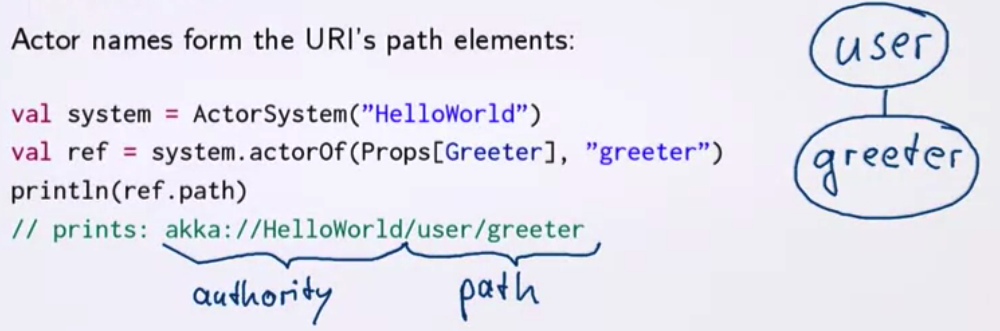
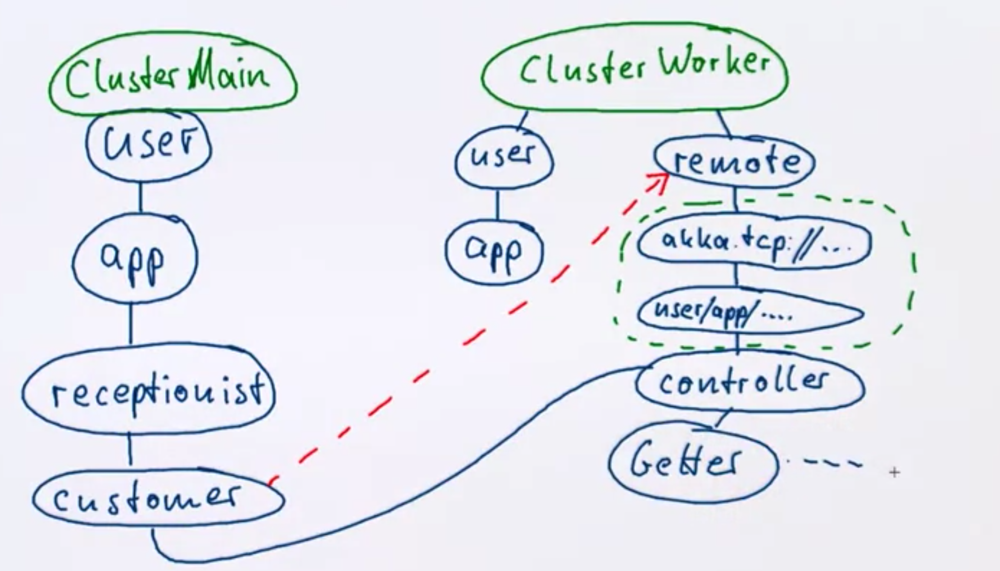
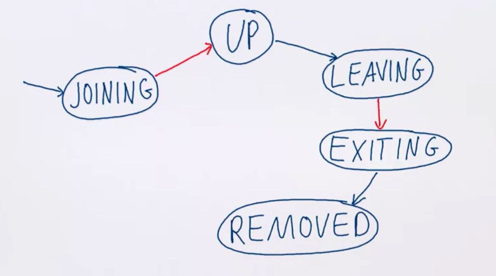

# Distributed Computing

## Actors Are Distributed

Actors are designed to be distributed:

- Actors communication is asynchronous, one-way and not guaranteed to arrive.
- Actor encapsulation makes them look the same, regardless where they live.
- Actors are "Location Transparent", hidden behind ActorRef.

**Behind the scenes:**

### Actor Paths

Every actor system has an Address, forming scheme and authority of a hierarchical URI.



Remote address example: akka.tcp://HelloWorld@10.2.4.6:6565/user/greeter

Every actor is identified by at least one URI. Actor names are unique within a parent, but can be reused.

**The difference between ActorRef and ActorPath**

- ActorPath is the full name, whether the actor exists or not.
- ActorRef points to an actor which was started; an incarnation.
- ActorPath can only optimistically send a message.
- ActorRef can be watched.
- ActorRef example: akka://HelloWorld/user/greeter#**43428347**

At the end the real difference is the UUID of the ActorRef compared to the ActorRef, that is called the incarnation of ActorPath (akka://HelloWorld/user/greeter#**43428347**).

When communicating with remote system is necessary to talk to actors that you did not create. You just know at which host the actor lives. To support this the actor context has a method called "context.actorSelection(path)" that constructs the actor to send the message to. There is one message that any actor can handle and it is given by "Identify((path, sender))", this is to see if the actor on the path is alive or not. If it alive is will reply with a message ActorIdentify((path, client), Some(ref)).

```scala
import akka.actor.{Identify, ActorIdentify}
case class Resolve(path: ActorPath)
case class Resolved(path: ActorPath, ref: ActorPath)
case class NotResolved(path: ActorPath)

case Resolver extends Actor {
  def receive = {
    case Resolve(path) => 
    		// It tries to resolve the path and getting the ActorRef, so it sends Identify to the path and who is sending the message (sender)
    		context.actorSelection(path) ! Identify((path, sender))
    // If the message received is ActorIdentify with Some(ref) the actor is alive and the actorRef is given by Some(ref).
    case ActorIdentity((path, client), Some(ref)) => 
    		client ! Resolved(path, ref)
    // If not probably there is no actor at the other end.
    case ActorIdentity ((path, client), None) => 
    		client ! NotResolved(path)
  }
}
```

**Actor paths do not need to be absolute, they can be relative, for example:**

- Looking up a grand-child: context.actorSelection("child/grandchild").
- Looking up a sibling: context.actorSelection("../sibling").
- Looking up from the local root: context.actorSelection("/user/app").
- Broadcasting using wildcards: context.actorSelection("/user/controllers/*")

**What is a Cluster?** A set of nodes(actor systems) about which all members are in agreement. These nodes can then collaborate on a common task. Cluster membership can change over time.

**The Formation of a Cluster is inductive reasoning**: 

- It starts with one node that declare itself a cluster (join itself).
- A single node can join a cluster:
  - A request is sent to any member.
  - Once all current members know about the new node it is declared part of the cluster.

Information is spread using a gossip protocol (order passed by word of mouth), every node will gossip to few of his peers, so eventually the information will spread through the cluster (epidemic).

### Setting Up a Cluster

Let's see how the formation of a cluster works in practice.

**Prerequisites**:

- "com.typsafe.akka" %% "akka-cluster" % "2.2.1".

- Configuration enabling cluster module:

  ```scala
  akka {
    actor {
      provider = akka.cluster.ClusterActorRefProvider
    }
  }
  
  // Goes in application.conf or as -Dakka.actor.provider=...
  ```

This configure the actor system to use a different mechanism when creating actors. All calls to context.actorOf are in the end handled by the actorRef provider.

**Starting up a cluster**:

**First Node**:

```scala
// This will start a single-noode cluster on port 2552  (default port)
class ClusterMain extends Actor {
  // This actor when it starts up obtain the cluster extension of the system.
  val cluster = Cluster(context.system)
  // It subscribe to some events of the cluster
  cluster.subscribe(self, classOf[ClusterEvent.MemberUp])
  // Finally it joins its own address, this is the first step so the node declare itself a cluster and join itself.
  cluster.join(cluster.selfAddress)
  
  def receive = {
    // We wait for MemberUp event for which we registered.
    case ClusterEvent.MemberUp(member) => 
    		// if the member address is not the current one, someone else joined.
    		if(member.address != cluster.selfAddress)
    				// someone joined
  }
}
```

**Second/ more Node**:

```scala
// This needs configuration akka.remote.netty.tcp.port = 0 to pick a random port for this actor
class ClusterWorker extends Actor {
  val cluster = Cluster(context.system)
  // We register for the MemberRemoved in this case
  cluster.subscribe(self, classOf[ClusterEvent.MemberRemoved])
  // We get the main cluster ref on port 2552
  val main = cluster.selfAddress.copy(port = Some(2552))
  // We join the cluster
  cluster.join(main)
  
  def receive = {
    	case ClusterEvent.MemberRemoved(m, _) => 
        	// When the main member is removed, we stop the actor as well
    			if (m.address == main) context.stop(self)
  }
}
```

**Cluster Aware Routing**:

```scala
class ClusterReceptionist extends Actor {
  
  val cluster = Cluster(context.system)
  // First of all the receptionist needs to know who is and who is not in the cluster, so it subscribe to memberup and remove events.
  cluster.subscribe(self, classOf[MemberUp])
  cluster.subscribe(self, classOf[MemberRemoved])
  
  
  // When is stops it unsubscribe itself
  override def postStop(): Unit = {
    cluster.unsubscribe(self)
  }
  
  def receive = awaitingMembers
  
  val awaitingMembers: Receive = {
    //The actor will always receive in response to cluster.subscribe the ClusterEvent.CurrentClusterState that contains the list of actors in the cluster
    	case current: ClusterEvent.CurrentClusterState => 
    			//Extract all the address of the cluster
    			val addresses = current.members.toVector map (_.address)
    			//Filter out the filter address
     			val notMe = addresses filter (_ != cluster.selfAddress)
    			// If there is another node in the cluster (notMe),  I change to active behaviour.
    			if(notMe.nonEmpty) context.become(active(notMe))
    // If a new member is joining, add it to the active cluster behaviour (this is the case of notMe is empty)
    	case MemberUp(member) if member.address != cluster.selfAddress =>
    			context.become(active(Vector(member.address)))
    // If no nodes available we reply saying that there aren't (no computing resources available)
    	case Get(url) =>. sender ! Failed(url, "no nodes available")
  }
}

def active(addresses: Vector[Address]): Receive = {
  	// When we receive a new member we add it
  	case MemberUp(member) if member.address != cluster.selfAddress => 
  			context.become(active(addresses :+ member.address))
  	case MemberRemoved(number, _ ) => 
  			val next = addresses filterNot (_ == member.address)
  			// if the one left is the last one we go back to awaitingMembers otherwise we just remove it.
  			if (next.isEmpty) context.become(awaitingMembers)
  			else context.become(active(next))
  
		// NOW INTERESTING PART OF COMPUTATION, THE PREVIOUS ONE WAS JUST TO MANAGE THE CLUSTER KNOWLEDGE BASE.
  
  // When a get request comes in the active state, we look if the currently running requests (context.children.size) is less than the addresses we know about. Otherwise all the actors are busy satisfying one request.
   case Get(url) if context.children.size < addresses.size =>
  			// then we copy the client (requester)
  			val client = sender
  			// We pick an address randomly from the list
  			val address = pick(addresses)
  			// We create a new actor a Customer, that performs the computation. NOTE: address as parameter where the computation needs to be performed.
  			context.actorOf(Props(new Customer(client, url, address)))
  case Get(url) =>
  			sender ! Failed(url, "too many parallel queries")
}
```

**Remote Deployment**:

```scala
class Customer(client: ActorRef, url: String, node: Address) extends Actor {
  // All the messages sent by this actor will appear as sent by its parent, because we use implicit val s that overrides the local configuration of s (Self reference).
  implicit val s = context.parent
  
  override val supervisorStrategy = SupervisorStrategy.stoppingStrategy
  // This creates the actor not on the local node but on the address (parameter node)
  val props = Props[Controller].withDeploy(Deploy(scope = RemoteScope(node)))
  val controller = context.actorOf(props, "controller")
  context.watch(controller)
  
  // Now we are sending the message not to a local node but to a REMOTE ONE.
  context.setReceiveTimeout(5.seconds)
  controller ! Controller.Check(url, 2)
  
  def receive = ...
}
```

### Behind the scenes of the previous code

1. The whole program starts because we istantiate the cluster main app actor and it's guardian actor (the root actor, also called the guardian actor, is created along with the `ActorSystem`. Messages sent to the actor system are directed to the root actor) and we have different nodes (likely from different server) that are ClusterWorker actors, and they offer computational power.
2. Locally we have the clusterReceptionist that manages the Get(Url) request and when one of them arrives istantiate a customer actor (still locally).
3. The Customer actor deploy the controller in one node of the cluster worker that performs the operation. 
4. This actor woke also has a user guardian and an application (But this application does not do anything besides waiting for the termination of the program).  This system has also a remote guardian and when the customer deploys the controller, what it really does it to send a message to the remote guardian. The remote guardian will first create a folder so that it can keep actors deployed from different other systems. And within it, it will create a marker for that user/app/receptionist/customer and so forth. AND then it will finally create the controller actor.



**LEADER**: There is not single point of bottleneck in AKKA cluster, although it has a leader. The leader is not elected, any node can be the leader, and is statically determined by the set of node address. They are sort based on a format and always the first of the list becomes the leader. Since everyone agrees who is in the list and the sort order, everybody will see who is the leader. So the leader is a single node in the cluster that acts as the leader. Managing cluster convergence and membership state transitions. The role of the `leader` is to shift members in and out of the cluster, changing `joining` members to the `up` state or `exiting` members to the `removed` state. Currently `leader` actions are only triggered by receiving a new cluster state with gossip convergence. You can get its address from `Cluster(system).state.leader` or listen for the `LeaderChanged` cluster domain event to get notified when it changes. In Akka cluster, there is a membership lifecycle for every node. The  node begins with the joining state. Once all nodes have seen that the new  node is joining through a gossip protocol, the leader will set a node in up. If the node leaving the cluster is safe, it switches to the leaving state. Once the leader sees the node in the leaving state, the leader will set a node in the exiting state. Once all node sees the exiting state,  the leader will remove the node from the cluster and mark it as removed. If something abnormal happens on the node, it is set unreachable until  the leader decides to mark it down.

**Actor states in the cluster**:



### Cluster needs failure detection

Consensus is unattainable if some members are unreachable. Every node is monitored using heartbeats from several others (neighbours monitor each others). A node unreachable from one other is considered unreachable for all. Nodes can be removed to restore the cluster consensus. But a node unreachable for a period of time, is just a flag that each node has in the internal routing table for that unreachable actor. Once it comes back working, it can return to serve the requests. If this node after a period of time doesn't come back working, it goes to the state DOWN. Once every node through gossip knows that the node is down, the leader put it in the state "removed" and communicate to the other nodes.

## Eventual Consistency

**Strong Consistency**: After an update completes all reads will return the updated value.

```scala
private var field = 0
def update(f: Int => Int): Int = synchronized {
  field = f(field)
  field
}
def read(): Int = synchronized { field }
```

**Weak Consistency**: After an update conditions need to be met until reads return the update value; this is the inconsistency window.

```scala
private @volatile var field = 0
def update(f: Int => Int): Future[Int] = Future {
  // this block is executed in the future that means that the update block returns a future of the new value and the thread can continue his computation.
  synchronized {
    field = f(field)
    field
  }
}
// will take some time until the new value is visible.
def read(): Int = field
```

**Eventual Consistency**: Once no more updates are made to an object there is a time after which all reads return the last written value.

```scala
case class Update(x: Int)
case object Get
case class Result(x: Int)
case class Sync(c: Int, timestamp: Long)
case object Hello

class DistributedStore extends Actor {
  var peers: List[ActorRef] = Nil
  // The goal is that each actor in different nodes will have the most updated field.
  var field = 0
  var lastUpdate = System.currentTimeMillis()
  
  def receive = {
    // Everytime an update comes in, we write to the field and take the current timestamp and after we tell to all the peers in the cluster the field with the timestamp
    case Update(x) => 
    		field = x
    		lastUpdate = System.currentTimeMillis()
    		peers foreach (_ ! 	Sync(field, lastUpdate))
    // When a get request comes in we reply with current field
    case Get => sender ! Result(field)
    // When a sync message comes in with a potential new value, we check if the timestamp is newer than the one we know, if it is true, we update our field and last timestamp, otherwise ignore.
    case Sync(x, timestamp) if timestamp > lastUpdate =>
    		field = x
    		lastUpdate = timestamp
    // If hello message arrives, we add the sender to the peers and we know that we have to keep it updated.
    case Hello =>
    		peers ::= sender
    		sender ! Sync(field, lastUpdate)
  }
}
```

**Actors and Eventual Consistency**:

- Collaborating actors can at most be eventually consistent.
- Actors are not automatically eventually consistent.
- Event consistency requires eventual dissemination  of all updates.
- Need to employ suitable data structures, for example CRDTs

### Scalability

- Low performance means the system is slow for a single client.
- Low scalability means the system is fast when used by a single client but slow when used by many clients.

**Replication of Actors**: One actor can process one message at a time. Stateless replicas can run concurrently. We can create worker pools and the routing to serve those workers can be:

- Stateful (round robin, smallest queue, adaptive, ...).
- Stateless (random, consistent hashing, ...).

## Responsiveness

Responsiveness is the ability to respond to input in time. A system which does not respond in time is not available. The goal of resilience is to be available. Responsiveness implies resilience to overload scenarios.

**MORE INFO:** [REACTIVE MANIFESTO](https://www.reactivemanifesto.org/)
