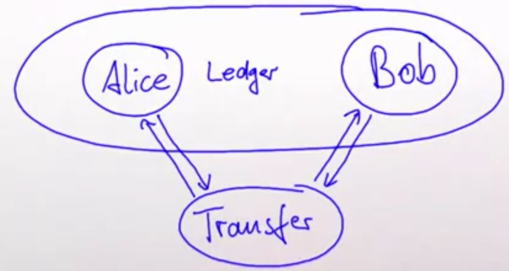

# Typed Actors

## Introduction to protocols

- Protocols are ubiquitous in our society.
- Successful communication needs the recipient to be ready.
- The protocol governs not only when but also what is sent.
- The message type is specified for each step

Two options:

- We can represent all the exchanges between A and B through one channel that has one end in A and one end in B. If we do this, the channel has to accept different types of messages at different steps of the protocol.
- We exchange channel between participants such as each participants has different channel for each message type.

## Protocols in Akka Typed

The goal: restrict ActorRef to sending the right message (correct message type), to do this:

	- We need to add a type parameter ActorRef[T].
	- Only allow sending type T with tell/ !.
	- The recipient needs to declare what type message it understand, so we need to add the type to trait Actor (*).
	- We need as well to set the type of the actor context with ActorContext[T].
	- Remove context.sender because can't be no longer be returned by the actor context, because any arbitrary actor in the actor system, could have sent this message, we cannot know the self type of that.

E.g.: Minimal protocl: accept one message and then stop.

```scala
val greeter: Behavior[String] = 
// 	In akka types we don't create an actor, we create its behaviour. Here the behavior is receiveMessage.
		Behaviors.receiveMessage[String] { whom => 
      	println(s"Hello $whom!")
      // the next behavior is stopped, so not process any message this actor.
      	Behaviors.stopped
    }

// To let work the behavior we place it inside the ActorSystem (primitive guardian). This means that the guardian is ready to process messages of type String.
val system: ActorSystem[String] = ActorSystem(greeter, "helloworld")

// send a message to the guardian
system ! "world"
```

```scala
// Another example with algebraic data types
sealed trait Greeter
final case class Greet(whom: String) extends Greeter
final case object Stop extends Greeter

val greeter: Behavior[Greeter] =
		Behaviors.receiveMessage[Greeter] {
      case Greet(whom) =>
      	println(s"Hello $whom!")
      	// This is a special type that allows to express that behavior should not change (can process another message).
      	Behaviors.same
      case Stop =>
      	println("shutting down...")
      	Behaviors.stopped
    }
```

### Handling typed responses

A response of type T must be sent via an ActorRef[T]:

```scala
sealed trait Guardian
case class NewGreeter(replyTo: ActorRef[ActorRef[Greeter]]) extends Guardian
case object Shutdown extends Guardian

val guardian = Behaviors.receive[Guardian] {
  	case (ctx, NewGreeter(replyTo)) => 
  			val ref: ActorRef[Greeter] = ctx.spawnAnonymous(greeter)
  			replyTo ! ref
  			Behavior.same
  	case (_, Shutdown) =>
  			Behavior.stopped
}
```

Let's implement the protocol of the images below with what we explained:


```scala
// This type does not only contains the title, but even ActorRef were the quote should be sent
case class RequestQuote(title: String, buyer: ActorRef[Quote])

// same but the seller that should receive the response from the buyer
case class Quote(price: BigDecimal, seller: ActorRef[BuyOrQuit])

sealed trait BuyOrQuite
// once the buyer process the quote, can decide to buy it and send the message and the seller can reply to the buyer with the shipping date.
case class Buy(address: Address, buyer: ActorRef[Shipping]) extends BuyOrQuite
case object Quit extends BuyOrQuit

case class Shipping(date: Date)
```

## Akka Typed Facilities

### Speaking multiple protocols

For example based on the example before, if we add the secretary, she should be able to speak the buyer protocol and the seller one (image below):


```scala
sealed trait Secretary
case class BuyBook(title: String, 
                   maxPrice: BigDecimal,
                   seller: ActorRef[RequestQuote]) extends Secretary
/*
In addition to the BuyBook, there are two messages:
QuoteWrapper that wraps a quote coming from the seller 
and
ShippingWrapper that does the same for the shipping message
*/
case class QuoteWrapper(msg: Quote) extends Secretary
case class ShippingWrapper(msg: Shipping) extends Secretary

def secretary(address: Address): Behavior[Secretary] =
		Behaviors.receivePartial {
      	case (ctx, BuyBook(title, maxPrice, seller)) =>
      				/*
      				In order to obtain the ActorRef were the quote shall be sent,
      				we use context.messageAdapter and specify a function that wraps 
      				one type of message in another. This results in ActorRef for Quote.
      				*/
      				val quote: ActorRef[Quote] = ctx.messageAdapter(QuoteWrapper)
              seller ! RequestQuote(title, quote)
              buyBook(maxPrice, address)
    }

def buyBook(maxPrice: BigDecimal, address: Address) : Behavior[Secretary] =
		Behaviors.receivePartial {
      	case (ctx, QuoteWrapper(Quote(price, session))) =>
      				if(price > maxPrice) {
                 session ! Quit // 	The seller is told that transaction is off
                 Behaviors.stopped
              }
     					else {
                // Otherwise we send to the seller the buy.
                val shipping = ctx.messageAdapter(ShippingWrapper)
                session ! Buy(address, shipping)
                Behaviors.same
              }
      case (ctx, ShippingWrapper(Shipping(data))) => 
      			Behaviors.stopped
    }
```

## Akka Typed Persistence

Example:

- Alice and Bob have accounts held in a ledger.
- The transfer is performed in two steps (first withdraw money from Alice, after send to Bob's account) by a transfer actor.
- When the credit to Bob fails, Alice gets a refund (rollback).



```scala
sealed trait Ledger
case class Debit (account: String, amount: BigDecimal,
                 	replyTo: ActorRef[Result]) extends Ledger
case class Credit (account: String, amount: BigDecimal,
                  replyTo: ActorRef[Result]) extends Ledger

ActorSystem(Behaviors.setup[Result]) { ctx => 
  	// After spawning the ledger actor
		val ledger = ctx.spawn(Ledger.Initial, "ledger")
   // We describe the Transfer in a 'TransferConfig' object, in this example we want to transfer 1000 to Alice to Bob, the result should be sent to this guardian actor (ctx.self)
  	val config TransferConfig(ledger, ctx.self, 1000, "Alice", "Bob")
  /* Next we need to spawn the transfer saga itself, we use PersistentBehaviors.receive, we need a persistenceId, because when this actor is restarted, all events that have been accumulated so far are replayed and saga continue from the point it left. 
  Next point we need to tell the state which saga should start (AwaitingDebit from Alice's account), when the actors starts up, it will initially have an empty event log, so AwaitingDebit will be the state it wakes up in. */
  val transfer = ctx.spawn(PersistentBehaviors.receive(
  				persistenceId = "transfer-1",
  				emptyState = AwaitingDebit(config),
  				commandHandler = commandHandler,
  				eventHandler = eventHandler
  ), "transfer")
  Behaviors.receiveMessage(_ => Behaviors.stopped)
}, "Persistence")

// The saga's INPUT COMMANDS
sealed trait Command
case object DebitSuccess extends Command
case object DebitFailure extends Command
case object CreditSuccess extends Command
case object CreditFailure extends Command
case object Stop extends Command

// The saga's EVENTS
sealed trait Event
case object Aborted extends Event
case object DebitDone extends Event
case object CreditDone extends Event
case object RollbackStarted extends Event
case object RollbackFailed extends Event
case object RollbackFinished extends Event

// The stateful command handler
sealed trait State
case class AwaitingDebit(config: TransferConfig) extends State
case class AwaitingCredit(config: TransferConfig) extends State
case class AwaitingRollback(config: TransferConfig) extends State
case class Finished(result: ActorRef[Result]) extends State
case class Failed(result: ActorRef[Result]) extends State


// The state the command is in, determines who will handle incoming commands
val commandHandler: CommandHandler[Command, Event, State] =
		CommandHandler.byState {
      case _: AwaitingDebit => awaitingDebit
      case _: AwaitingCredit => awaitingCredit
      case _: AwaitingRollback => awaitingRollback
      case _ => (_, _, _) => Effect.stop
    }

// Handling a Saga Step
val awaitingDebit: CommandHandler[Command, Event, State] = {
  case (ctx, AwaitingDebit(tc), DebitSuccess) => 
  		// If the response from ledger is success we know that we detracted the amount from the Alice's account and we persist it. After this event has written to a persistent storage and applied to the state of this actor, we attach a callback that performs the next step of the operation (credit command to the ledger to credit to bob). 
  		Effect.persist(DebitDone).andThen { state => 
        // The result of the Ledger goes to saga through event CreditSuccess or CreditFailure through the adapter.
      		tc.ledger ! Credit(tc.to, tc.amount, adapter(ctx, {
            case Success => CreditSuccess
            case Failure => CreditFailure
          }))}
  case (ctx, AwaitingDebit(tc), DebitFailure) =>
  // If fail we can stop because nothing was persisted so far.
  		Effect.persist(Aborted)
  					.andThen((state: State) => tc.result ! Failure)
  					.andThenStop
  case x => throw new IllegalStateException(x.toString)
}

// Handling a saga event
val eventHandler: (State, Event) => State = { (state, event) => 
		(state, event) match {
      case (AwaitingDebit(tc), DebitDone) => AwaitingCredit(tc)
      case (AwaitingDebit(tc), Aborted) => Failed(tc.result)
      case (AwaitingCredit(tc), CreditDone) => Finished(tc.result)
      case (AwaitingCredit(tc, RollbackFinished) => Failed(tc.result)
      case (AwaitingRollback(tc), RollbackFinished) => Failed(tc.result)
      case (AwaitingRollback(tc), RollbackFailed) => Failed(tc.result)
      case x => throw new IllegalStateException(x.toString)
    }
}
    
/*
When waking up after a crash, the saga may find itself in any state:
- Needs to take up the transfer again while still successful.
- Needs to take up the rollback again if already failed.
- Needs to signal completion if already terminated.
*/
PersistentBehaviors.receive(
...
).onRecoveryCompleted {
  case(ctx, AwaitingDebit(tc)) => 
  		ledger ! Debit(tc.from, tc.amount, adapter(ctx, {
        case Success => DebitSuccess
        case Failure DebitFailure
      }))
 case (ctx, Finished(result)) => 
  		println("still finished")
			ctx.self ! CreditSuccess // Will effectivelly stop this actor
			result ! Success
 case (ctx, Failed(result)) => 
			println("still failed")
			ctx.self ! CreditSuccess // Will effectively stop this actor
  		result ! Failure
  )
}
```

