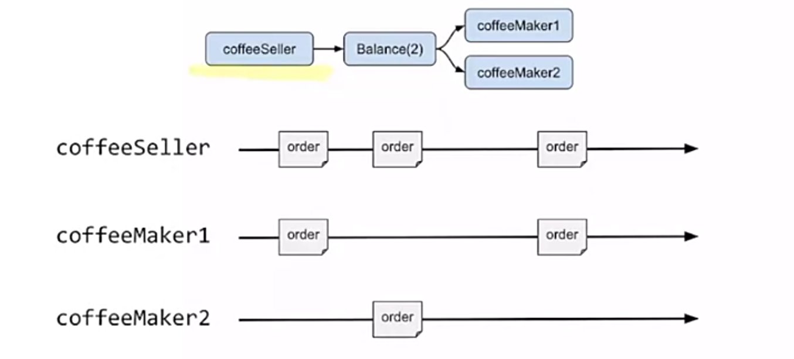

# Advance Stream Processing

## Streaming Protocols & Stream Composition

**Protocols can be classified as either stream or message-based:**

- **Stream based protocols** generally speaking will expose "(potentially) infinite stream of data", and writes and reads operate by adding/ reading from this infinite stream. One example is TCP.

- **Message based protocols** allow sending/ reading a specific "single" message, framing and other implementation details behind obtaining an entire message, are hidden from end users. Examples: UDP (datagrams), actor messaging.

Using TCP in Akka Streams: Reactive Streams, including Akka Streams, are message based - you can receive a single element and the request semantics also are defined in terms of elements. It is however possible to combine the two, and in combination with a framing mechanism, obtain a useful, back-pressured way to utilise raw TCP connections in your applications.

TCP Echo Server in Akka Streams:

```scala
import akka.actor._
import akka.stream.scaladsl._

implicit val system = ActorSystem("tcp-echo")
implicit val mat = ActorMaterializer

// You can think of Flow as being the incoming data from the TCP connection and outgoing data to the TCP connection.
val echoLogic = Flow[ByteString]
Tcp(system).bindAndHandle(echoLogic, "127.0.0.1", 1337)
```

TCP Client Server in Akka Streams:

```scala
// We will open a connection to the port 1337 (echo server)
/*
val clientFlow: Flow[
ByteString, // incoming element type
ByteString, // outgoint element type
Future[Tcp.OutgoingConnection] // materialized value type
]
Materialized values are tremendously useful to carry additional information or control structures:
clientFlow.mapMaterializedValue(_.map { connection => println ("connection established")})
*/
val clientFlow: Flow[ByteString, ByteString, Future[Tcp.OutgoingConnection]] = Tcp().outgoingConnection("127.0.0.1", 1337)
// This will serve as our client sending one message every second to the server
val localDataSource = Source.repeat(ByteString("Hello")).throttle(1, per = 1.second, maximumBurst = 10, mode = Throttle)
// For each byte string icoming from the server will perform println
val localDataSink = Sink.foreach[ByteString](data => println(s"from server $data"))
// Will materialize the stream and make the connection to the server.
localDataSource.via(clientFlow).to(localDataSink).run()
```

## Stateful operations and materialized values

Stateful operations: While stream processing often can "get away with" being stateless, such that each operator only needs to operate on the current element. Example of such stateless operators include map, filter and other classics. Sometimes we may need to implement an operator that depends on some state that it constructed from all previously porcessed elements.

statefulMapConcat:

```scala
source.
// IS basically flatMap
		statefulMapConcat { () => 
    	// safe to keep state here
    	var state = ???
    	// end of place to keep mutable state
    	
    	// invoked on every element:
    	element => {
        	val elementsToEmit = List[String]()
        
        	// return a List of elements that shall be emitted
        	elementsToEmit
      }
    }

/*
E.g. Implement zipWithIndex that produces elements paired with their index.
It has to keep track of how many elements have been previously produced
*/
def zipWithIndex[A]: Flow[A, (A, Int), _] =
	Flow[A].statefulMapConcat{ () => 
  		var i = -1
  		element => {
        i += 1
        (element -> i) :: Nil
      }}
/*
E.g. : filter above current average
Imagine you are implementing a ranking system, and from all incoming ratings maintain a 
current average rating.
Based on that value, you want to filter elements that are above the current average score.
*/
val aboveAverage: Flow[Rating, Rating, _] =
		Flow[Rating].statefulMapConcat { () => 
    		var sum = 0 // current sum of ratings
    		var n = 0 // number of summed ratings
    		rating => {
          sum += rating.value
          n += 1
          val average = sum / n
          if(rating.value >= average) rating ::  Nil
          else Nil
        }
    }
```

## Materialized values

Simplest example:

```scala
// gets the first elements that arrives at sink
val sink: Sink[Int, Future[Int]] = Sink.head
```

Sink describes a process that consumes at most one Int element. When this process is executed, it returns a Future[Int], which is completed when the element is received:

```scala
val eventuallyResult: Future[Int] = someSource.runWith(sink)
```

Here is an example of use of a value materialized by a Source:

```scala
// First, describe a source
/*
The source.maybe signified that this source maybe return an Integer.
*/
vval source: Source[Int, 	Promise[Option[Int]]]  = Source.maybe[Int]
// Second, materialize it
val promise: Promise[Option[Int]] = source.to(Sink.ignore).run()
// Third emit exactly one element
promise.complete(Some(42))
```

## Fan-in and Fan-out operations

**Sources, flows and sinks only allow sequential pipelines of transformations.**

- **Fan-In operatorions are operations which have multiple input ports.**
- **Fan-Out operations are operations which have multiple output ports.**

E.g.


### Merge Operator


```scala
def coffes (
	mokaPot: Source[Coffe, _],
	frenPress: Source[Coffe, _]): Source[Coffe, _] =
	mokaPot.merge(frenchPress)

// We produce coffees by taking them as they arrive from each brewing sytstem.
```

### Balance Operator



**Note: We can have dynamic fan-in/ fan-out operations, for example there are situations where you want to be able to add new input/ output ports after the graph has started running. An operation that can help with that is MergeHub which we can add more worker (input) based on the one we specify (can coming maybe from a worker pool).**
